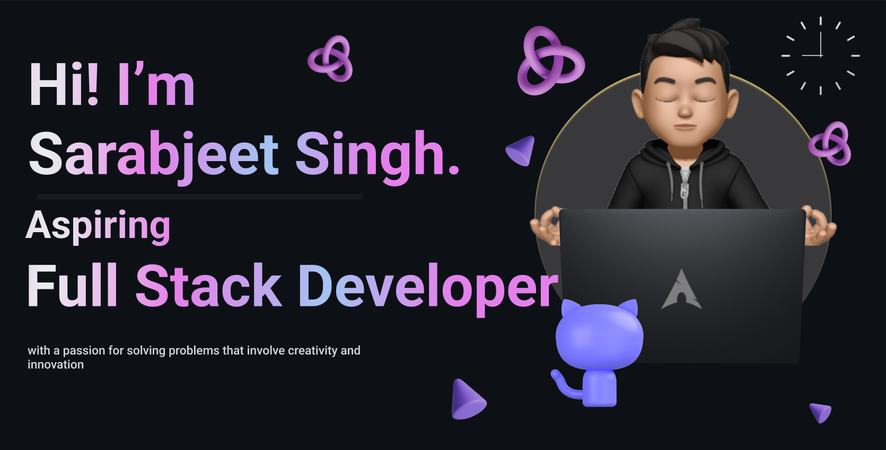

<h1 align="center">Hi 👋, I'm Sarabjeet Singh </h1>
<h3 align="center">A passionate FullStack Developer from India</h3>

<h3 align="left">💫 About Me:</h3>

- 🔭 I'm currently working on FARM stack & Python 

- 🌱 I'm currently learning Full Stack Development 

- 💬 Ask me anything about Linux/full Stack Web development/Flutter 

- 📫 How to reach me **sarabjeet.9353@gmail.com**

- ⚡ Fun Fact : Arch Linux is best

<h3 align="left">💻 Tech Stack:</h3>

                          

<h3 align="left">✍️ Projects</h3>
  
+ [E-commerce website](https://github.com/Linux-DEX/MERN-E-Commerce-fullstack.git)
	 An e-commerce site using **MERN tech integrates MongoDB, Express.js, React, and Node.js**, offering a **dynamic user experience** with efficient data storage, robust backend services, and responsive frontend interfaces.

+ [Mental health app](https://github.com/Linux-DEX/moodmate.git)
	 Elevate your mental well-being with this **Flutter and Firebase-powered app**, offering personalized tools for managing stress, tracking mood, and accessing supportive resources.

+ [YouTube UI/UX clone](https://github.com/Linux-DEX/youtube_clone-main.git)
     Experience the familiarity of YouTube's UI/UX with this **React project**, meticulously crafted to replicate the platform's intuitive design, seamless navigation, and engaging user experience.

+ [Linux & Hacking tools](https://github.com/Linux-DEX/Linux-Notes.git)
	 Discover **essential Linux commands** and a curated selection of **potent hacking tools notes in this repository**, empowering users with indispensable knowledge and resources for cybersecurity, system administration, and ethical hacking endeavors.

+ **My Custome Linux Config**
	+ Dotfile for Linux [dotfile for shell & other](https://github.com/Linux-DEX/dotfile.git) 
	+ Arch Based Qtile Config for X11 [Qtile Arco Linux config](https://github.com/Linux-DEX/Qtile.git)

<h3 align="left">📊 GitHub Stats:</h3>

&nbsp;

