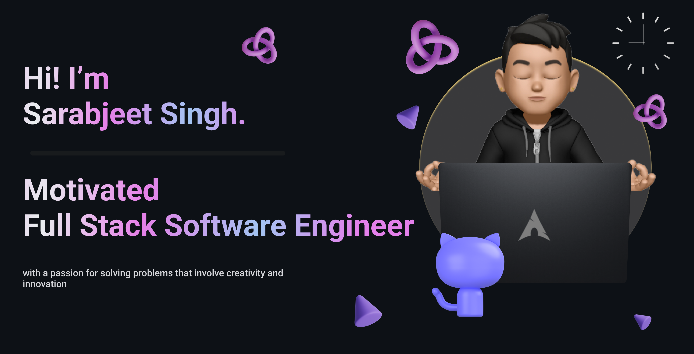

<div align="center">



# Hi 👋, I'm Sarabjeet Singh

### Full Stack Software Engineer | Cloud Enthusiast | Linux Lover

[](mailto:sarabjeet.9353@gmail.com)

</div>

---

## 💫 About Me

```yaml
role: Full Stack Software Engineer
experience: 2+ years in production environments
location: India
focus:
  - Building scalable cloud-native applications on Azure
  - Healthcare EDPS/EDI systems (837, 277, 999, MAO02, MOR, MMR)
  - AI Chatbots using RAG, LangChain & Azure OpenAI
  - Linux systems & performance optimization
passion:
  - Clean architecture
  - Scalable systems
  - Open source
```

---

## 🛠️ Tech Stack

### Languages


### Frontend


### Backend


### Database & Cloud


### DevOps & Tools


---

## 🚀 What I Build

- 🏥 **Healthcare Systems** - EDI/EDPS claim parsing & processing at scale
- 🤖 **AI Solutions** - RAG-based chatbots with semantic search
- ☁️ **Cloud Applications** - Scalable microservices on Azure/AWS
- 🔧 **Developer Tools** - MCP tools for AI agent integrations
- 📊 **Data Processing** - Systems handling 1M+ daily requests

---

## 📈 GitHub Stats

<div align="center">


</div>

---

<div align="center">

### 💡 "Clean code always looks like it was written by someone who cares"

</div>
